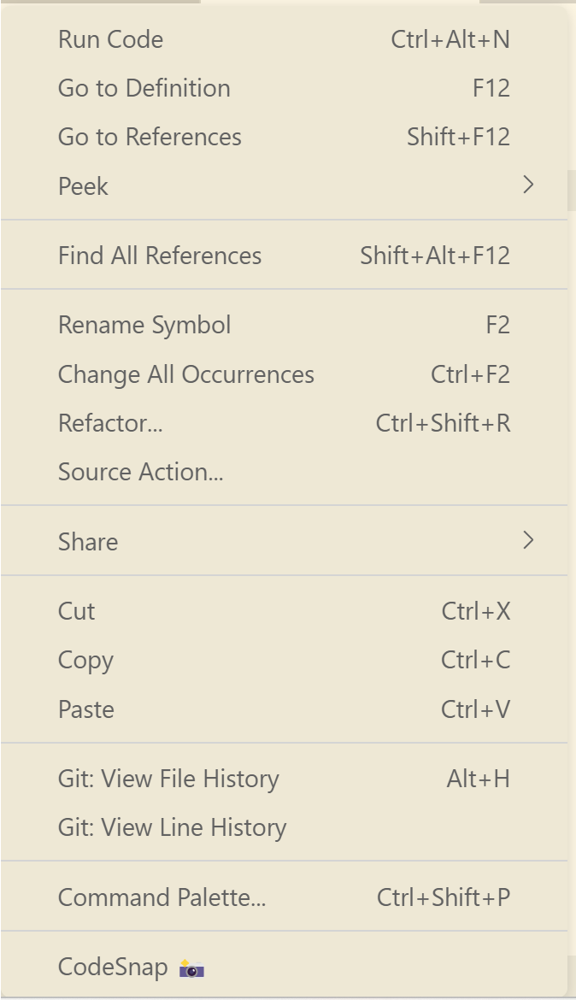
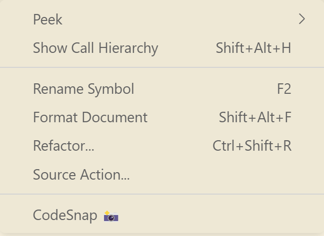

     
    
    <h1>Custom Contextmenu</h1>

Make the contextmenu of VSCode cleaner!

## Screenshots

| Before | After |
| --- | --- |
|  |  |

## Usage

1. install this extension in VSCode
2. open Command Pallete with `F1` or `ctrl+shift+p`
3. select `Enable Custom Contextmenu`
